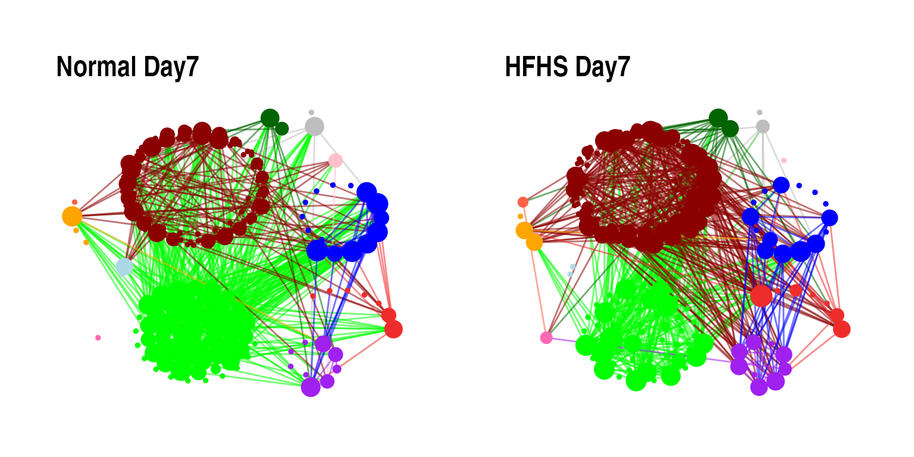
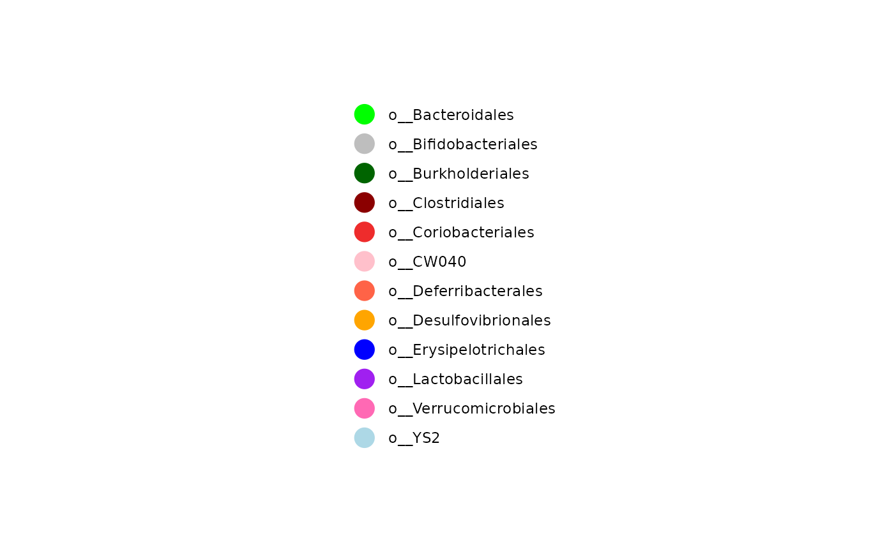
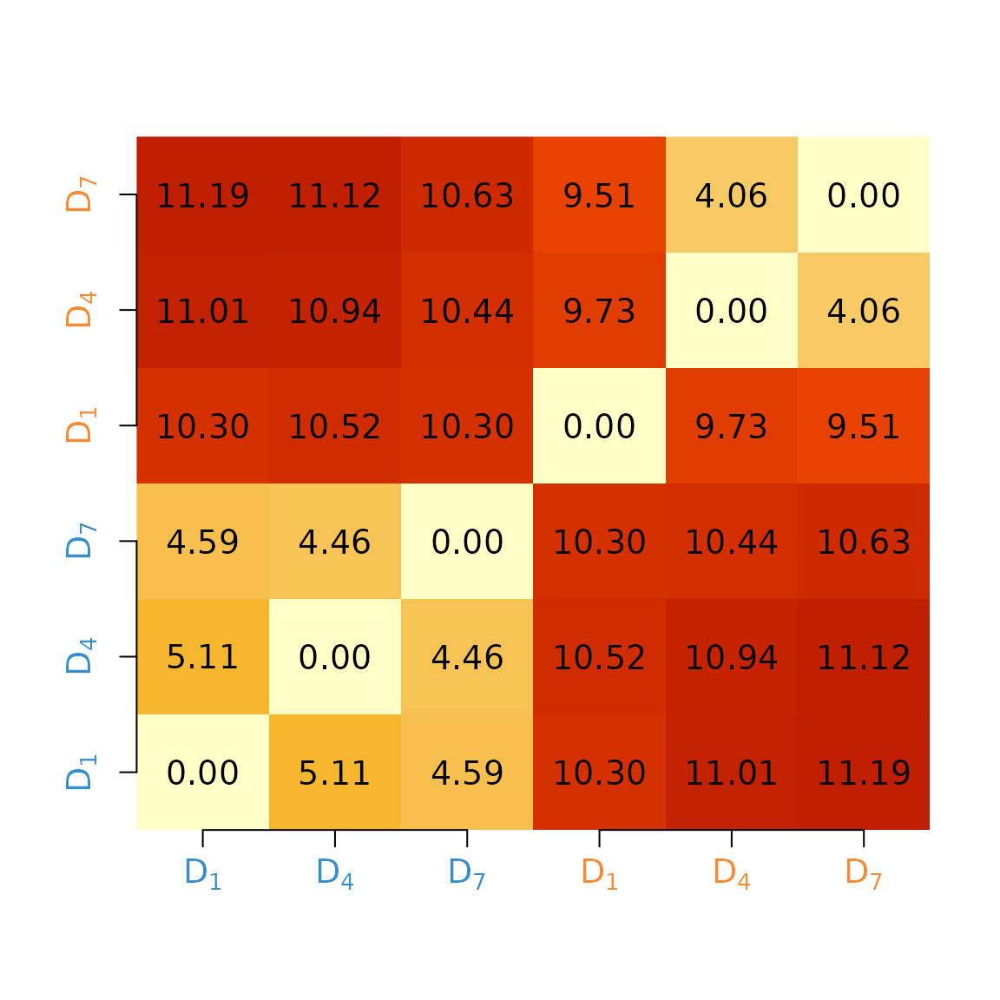
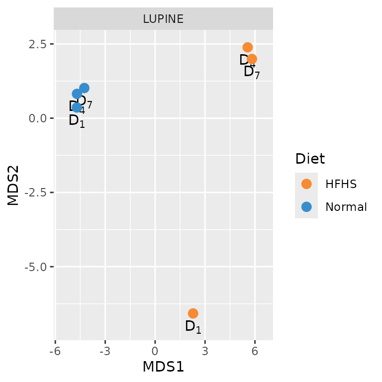
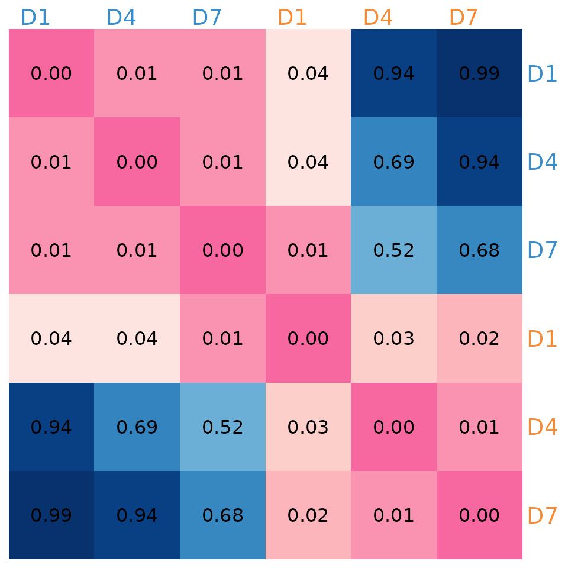
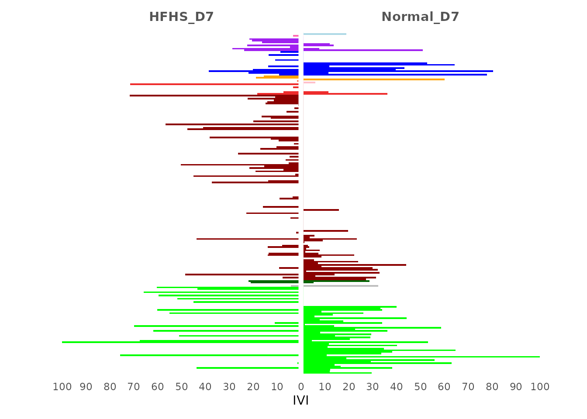
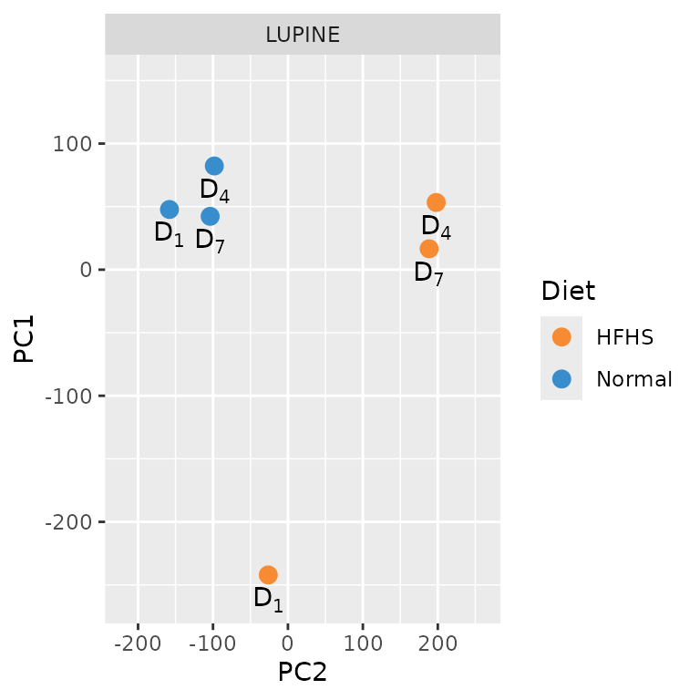
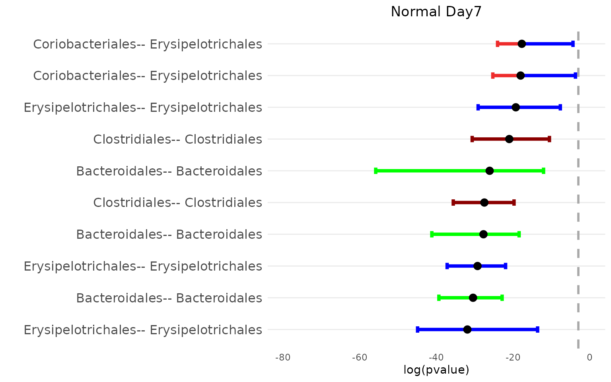
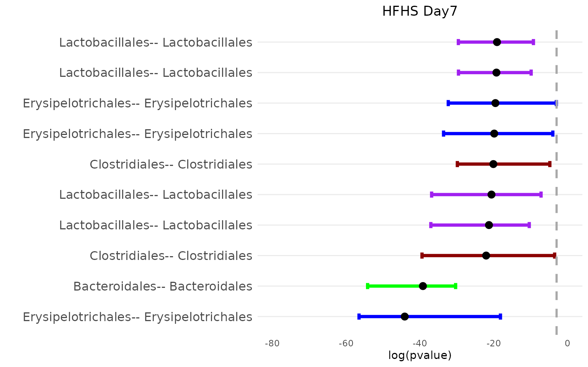

# High-Fat High-Sugar case study

## Introduction

In this vignette, we explore the High-Fat High-Sugar (HFHS) case study
using the `LUPINE` R package. The aim is to demonstrate how LUPINE can
be used to analyse and visualise microbiome data from mice on a normal
diet and an HFHS diet. The focus will be on Day 7 for both diets. We
will conduct network analyses, visualise the networks, and compare them
using IVI values, network distance, and the Mantel test. Additionally,
we will examine the top 15 associations for both diets using
bootstrap-based p-values.

### Setup

First, we load the necessary libraries:

``` r

library(LUPINE)
library(ggplot2) # ggplot
library(RColorBrewer) # brewer.pal
library(circlize) # colorRamp2
library(igraph) # graph.adjacency
library(dplyr) # mutate
library(tidygraph) # activate
library(ggraph) # ggraph
library(mixOmics) # pca
library(ComplexHeatmap) # Heatmap
library(patchwork) # plotting
library(cowplot) # plotting
library(qs2) # qread
set.seed(1234)
```

### Load data

To assess the effect of diet on the gut microbiome, 47 C57/B6 female
black mice were fed either an HFHS or a normal diet. Faecal samples were
collected on Days 0, 1, 4, and 7.

The raw data included 1,172 taxa across all four time points. We removed
one outlier mouse from the normal diet group due to an unusually large
library size. After filtering, we retained 102, 107, 105, and 91 taxa
for the normal diet across Days 0, 1, 4, and 7, respectively. For the
HFHS diet, the numbers were 99, 147, 85, and 92 taxa, respectively.
These data are saved as `OTUdata_Normal` and `OTUdata_HFHS` within the
`HFHSdata` object.

We load the `HFHSdata` object, which contains OTU data, sample
information, taxonomy information, library sizes, and excluded taxa for
both the normal and HFHS diets.

``` r

data("HFHSdata")
```

## LUPINE network analysis

We use `LUPINE` to infer co-occurrence networks for both the normal and
HFHS diets. The inferred networks are saved as `net_Normal` and
`net_HFHS`.

``` r

net_Normal <- LUPINE(HFHSdata$OTUdata_Normal,
  is.transformed = FALSE,
  lib_size = HFHSdata$Lib_Normal, ncomp = 1, single = FALSE,
  excluded_taxa = HFHSdata$low_Normal_taxa, cutoff = 0.05
)
qs_save(net_Normal, "output/net_Normal.qs2")

net_HFHS <- LUPINE(HFHSdata$OTUdata_HFHS,
  is.transformed = FALSE,
  lib_size = HFHSdata$Lib_HFHS, ncomp = 1, single = FALSE,
  excluded_taxa = HFHSdata$low_HFHS_taxa, cutoff = 0.05
)
qs_save(net_HFHS, "output/net_HFHS.qs2")
```

### Network visualization

``` r

net_Normal <- qs_read("output/net_Normal.qs2")
net_HFHS <- qs_read("output/net_HFHS.qs2")

Day0 <- HFHSdata$OTUdata_Normal[, , 1]
taxa_info <- HFHSdata$filtered_taxonomy[colnames(Day0), ]
taxa_info$X5 <- factor(taxa_info$X5)
col_vec <- rep(
  c(
    "green", "gray", "darkgreen", "darkred", "firebrick2", "pink",
    "tomato", "orange", "blue", "purple", "hotpink", "lightblue"
  ),
  summary(taxa_info$X5)
)

p1 <- netPlot_HFHS(net_Normal[[3]], col_vec, "Normal Day7")
p2 <- netPlot_HFHS(net_HFHS[[3]], col_vec, "HFHS Day7")
```

``` r

(p1 + p2)
```





On Day 7, we observe fewer connections among nodes belonging to the
*Bacteroidales* order in the HFHS diet group compared to the normal diet
group. In the normal diet group, nodes from the *Erysipelotrichales*
order are more connected to those from the *Bacteroidales* order.
However, in the HFHS diet group, nodes from *Erysipelotrichales* show
more connections to those from the *Lactobacillales* order.

## Network comparisons

We apply two approaches to compare the inferred networks: a network
distance measure to quantitatively evaluate the network topology and a
node-wise measure to assess the influence of individual nodes within the
network. We also conduct hypothesis tests to examine the differences
between network pairs.

### Using network distance

We use Graph Diffusion Distance (GDD) to measure pairwise differences in
network topologies. GDD evaluates the average similarity between two
networks by analysing information flow and connectivity through a heat
diffusion process on graphs.

``` r

dst <- distance_matrix(c(net_Normal, net_HFHS))
dst
#>           [,1]      [,2]      [,3]      [,4]      [,5]     [,6]
#> [1,]  0.000000  5.112057  4.589908 10.300243 11.008551 11.19028
#> [2,]  5.112057  0.000000  4.456630 10.521769 10.938152 11.12112
#> [3,]  4.589908  4.456630  0.000000 10.296871 10.444232 10.62990
#> [4,] 10.300243 10.521769 10.296871  0.000000  9.733988  9.51460
#> [5,] 11.008551 10.938152 10.444232  9.733988  0.000000  4.05905
#> [6,] 11.190284 11.121117 10.629899  9.514600  4.059050  0.00000
```

``` r

image(1:ncol(dst), 1:ncol(dst), dst,
  axes = FALSE, xlab = "",
  ylab = "", col = hcl.colors(600, "YlOrRd", rev = TRUE)[-c(500:600)]
)
text(expand.grid(1:ncol(dst), 1:ncol(dst)), sprintf("%0.2f", dst), cex = 1.2)
axis(1, 1:3, c(expression("D"[1]), expression("D"[4]), expression("D"[7])),
  cex.axis = 1.2, col.axis = "#388ECC"
)
axis(1, 4:6, c(expression("D"[1]), expression("D"[4]), expression("D"[7])),
  cex.axis = 1.2, col.axis = "#F68B33"
)
axis(2, 1:3, c(expression("D"[1]), expression("D"[4]), expression("D"[7])),
  cex.axis = 1.2, col.axis = "#388ECC"
)
axis(2, 4:6, c(expression("D"[1]), expression("D"[4]), expression("D"[7])),
  cex.axis = 1.2, col.axis = "#F68B33"
)
```



The pairwise network distance matrix indicates that networks inferred
from the normal diet group are more similar to each other than to those
from the HFHS diet group. As the number of networks increases, so do the
pairwise distances to compare. Therefore, we employ Multidimensional
Scaling (MDS) to visualise network distances in a 2D space, allowing for
a global assessment of network similarities and differences.

``` r

fit <- data.frame(cmdscale(dst, k = 3))
names <- c(paste0("D[", c(1, 4, 7), "]"), paste0("D[", c(1, 4, 7), "]"))
fit$name <- c(names)
fit$color <- rep(c("#388ECC", "#F68B33"), each = 3)
fit$title <- "LUPINE"
# Custom data frame for legend
legend_data <- data.frame(
  label = c("Normal", "HFHS"),
  color = c("#388ECC", "#F68B33")
)
p2 <- ggplot(fit, aes(x = X1, y = X2)) +
  geom_text(aes(label = name),
    parse = TRUE, hjust = 0.5, vjust = 1.5,
    show.legend = FALSE
  ) +
  geom_point(size = 3, col = fit$color) +
  labs(y = "MDS2", x = "MDS1") +
  xlim(c(-5.5, 6.5)) +
  ylim(-7, 2.5) +
  facet_wrap(~title)  +
  # Add legend points
  geom_point(data = legend_data, aes(x = 1000, y = -1000, color = label),
             size = 3, show.legend = TRUE) +
  # Manually set colors for the legend
  scale_color_manual(values = c("Normal" = "#388ECC", "HFHS" = "#F68B33"),
                     name = "Diet")

p2
```



### Testing the network correlations using Mantel test

We use the Mantel test to assess the correlation between the network
distance matrix and the pairwise distance matrix. This non-parametric
test evaluates whether two distance matrices are significantly
correlated.

``` r

mantel_res <- MantelTest_matrix(c(net_Normal, net_HFHS))
mantel_res
#>      [,1] [,2] [,3] [,4] [,5] [,6]
#> [1,] 0.00 0.01 0.01 0.04 0.94 0.99
#> [2,] 0.01 0.00 0.01 0.04 0.69 0.94
#> [3,] 0.01 0.01 0.00 0.01 0.52 0.68
#> [4,] 0.04 0.04 0.01 0.00 0.03 0.02
#> [5,] 0.94 0.69 0.52 0.03 0.00 0.01
#> [6,] 0.99 0.94 0.68 0.02 0.01 0.00
```

#### Visualising the p values

``` r

rownames(mantel_res) <- rep(paste0("D", c(1, 4, 7)), 2)

combined_breaks <- c(seq(0, 0.05, 0.001), seq(0.0501, 1, 0.001))
combined_colors <- c(
  rev(colorRampPalette(brewer.pal(9, "RdPu")[1:5])(51)),
  colorRampPalette(brewer.pal(9, "Blues"))(950)
)
combined_ramp <- colorRamp2(combined_breaks, combined_colors)

col_ha <- HeatmapAnnotation(
  col_labels = anno_text(rownames(mantel_res),
    rot = 360,
    gp = gpar(
      col = c(rep("#388ECC", 3), rep("#F68B33", 3)),
      fontsize = 14
    )
  )
)

ComplexHeatmap::Heatmap(mantel_res,
  col = combined_ramp,
  show_heatmap_legend = F,
  border = 0, name = "p-value",
  cluster_rows = F, cluster_columns = F,
  top_annotation = col_ha,
  row_names_gp = gpar(col = c(rep("#388ECC", 3), rep("#F68B33", 3)), cex = 1.2),
  cell_fun = function(j, i, x, y, width, height, fill) {
    grid.text(sprintf("%.2f", mantel_res[i, j]), x, y, gp = gpar(fontsize = 12))
  }
)
```



The Mantel test results indicate that networks from the normal diet
group are significantly correlated with each other and with the HFHS
diet networks on Day 1. However, the normal diet networks are not
significantly correlated with the HFHS diet networks on Days 4 and 7.

### Using IVI values

``` r

IVI_Normal <- IVI_values(net_Normal, "Normal", c(2, 4, 7))
IVI_HFHS <- IVI_values(net_HFHS, "HFHS", c(2, 4, 7))
IVI_comb <- rbind(IVI_Normal, IVI_HFHS)
qs_save(IVI_comb, "output/IVI_comb.qs2")
```

``` r

IVI_comb <- qs_read("output/IVI_comb.qs2")

op <- par(mar = rep(0, 4))
# matrix with only day 7 normal and HFHS IVI scores
m1 <- as.matrix(IVI_comb[c(3, 6), -c(1, 2)])
rownames(m1) <- c("Normal_D7", "HFHS_D7")
colnames(m1) <- as.factor(col_vec)

adjacency_df <- data.frame(Taxa = rep(taxa_info$X1, each = 2), as.table(m1))
adjacency_df <- adjacency_df %>% mutate(
  adjusted_value =
    ifelse(Var1 == "Normal_D7",
      Freq, -Freq
    )
)

# Ensure the variable column is treated as a factor (retains its original order)
adjacency_df$Taxa <- factor(adjacency_df$Taxa,
  levels = unique(adjacency_df$Taxa)
)

# Calculate y-position for annotations based on data
annotation_y <- length(unique(adjacency_df$Taxa)) + 15 # Adjust y position

# Adjust the margins in ggplot2
ggplot(adjacency_df, aes(x = Taxa, y = adjusted_value, fill = Var2)) +
  geom_bar(stat = "identity", position = "stack", width = 1) +
  coord_flip() +
  scale_y_continuous(
    breaks = seq(-100, 100, 10),
    labels = abs(seq(-100, 100, 10))
  ) +
  scale_x_discrete(limits = c(
    rep("", 2), levels(adjacency_df$Taxa),
    rep("", 2)
  )) +
  scale_fill_identity() +
  theme_minimal() +
  theme(
    panel.grid.major.y = element_blank(),
    panel.grid.minor.y = element_blank(),
    panel.grid.major.x = element_blank(),
    panel.grid.minor.x = element_blank(),
    axis.text.y = element_blank(),
    legend.position = "none",
    plot.margin = margin(10, 20, 10, 20) # Adjust margins
  ) +
  geom_hline(yintercept = 0, color = "white", linewidth = 2) +
  labs(x = "", y = "IVI") +
  # Add annotations for group labels with adjusted positions
  annotate("text",
    x = annotation_y, y = 50, label = "Normal_D7",
    hjust = 0.5, vjust = 1, fontface = "bold", color = "grey33"
  ) +
  annotate("text",
    x = annotation_y, y = -50, label = "HFHS_D7",
    hjust = 0.5, vjust = 1, fontface = "bold", color = "grey33"
  )
```



The IVI analysis shows that the Day 7 network from the normal diet group
has higher IVI values in the *Bacteroidales* and *Erysipelotrichales*
orders compared to the HFHS diet network. Conversely, the HFHS diet
network on Day 7 exhibits higher IVI values across most
*Lactobacillales* nodes. We perform Principal Component Analysis (PCA)
to visualise the IVI values in a 2D space, highlighting the strongest
patterns and capturing the most variance in the data.

``` r

pca_ivi <- pca(IVI_comb[, -(1:2)])
pca_ivi$names$sample <- rep(c("D[1]", "D[4]", "D[7]"), 2)
fit1 <- data.frame(pca_ivi$variates$X) %>% cbind(name = pca_ivi$names$sample)
fit1$color <- c(rep("#388ECC", 3), rep("#F68B33", 3))
fit1$title <- "LUPINE"
p1 <- ggplot(fit1, aes(x = PC1, y = PC2)) +
  ylim(-260, 150) +
  xlim(-220, 260) +
  geom_point(size = 3, col = fit1$color) +
  labs(y = "PC1", x = "PC2") +
  geom_text(aes(label = name), parse = TRUE, hjust = 0.5, vjust = 1.5) +
  facet_wrap(~title) +
  # Add legend points
  geom_point(data = legend_data, aes(x = 1000, y = -1000, color = label),
             size = 3, show.legend = TRUE) +
  # Manually set colors for the legend
  scale_color_manual(values = c("Normal" = "#388ECC", "HFHS" = "#F68B33"),
                     name = "Diet")

p1
```



The PCA plot, like the MDS plot, reveals that networks from the normal
diet group are more similar to each other than to those from the HFHS
diet group. Additionally, the normal diet networks on Day 7 are more
similar to those on Day 4 than to the HFHS diet networks on Day 7.

### Bootsrap base top 15 associations for day 7 under normal and HFHS diets

``` r

netBoot_Normal <- LUPINE_bootsrap(
  data = HFHSdata$OTUdata_Normal, day_range = 4, is.transformed = FALSE,
  lib_size = HFHSdata$Lib_Normal, ncomp = 1,
  single = FALSE, excluded_taxa = HFHSdata$low_Normal_taxa, cutoff = 0.05,
  nboot = 1000
)
qs_save(netBoot_Normal, "output/netBoot_Normal.qs2")

netBoot_HFHS <- LUPINE_bootsrap(HFHSdata$OTUdata_HFHS,
  day_range = 4,
  is.transformed = FALSE, lib_size = HFHSdata$Lib_HFHS, ncomp = 1,
  single = FALSE, excluded_taxa = HFHSdata$low_HFHS_taxa, cutoff = 0.05,
  nboot = 1000
)

qs_save(netBoot_HFHS, "output/netBoot_HFHS.qs2")
```

``` r

netBoot_Normal<-qs_read("output/netBoot_Normal.qs2")
netBoot_HFHS<-qs_read("output/netBoot_HFHS.qs2")
```

#### Visualising log pvalues for Normal and HFHS diets

``` r

# Normal_d7
op <- par(mar = rep(0, 4))
taxa_o <- gsub("o__", "", taxa_info$X5)
bpvalPlot_HFHS(netBoot_Normal$Day_4$median_mt, netBoot_Normal$Day_4$lower_mt, netBoot_Normal$Day_4$upper_mt, col_vec, 15, taxa_o, "Normal Day7")
```



``` r

# HFHS_d7
op <- par(mar = rep(0, 4))
taxa_o <- gsub("o__", "", taxa_info$X5)
bpvalPlot_HFHS(netBoot_HFHS$Day_4$median_mt, netBoot_HFHS$Day_4$lower_mt, netBoot_HFHS$Day_4$upper_mt, col_vec, 15, taxa_o, "HFHS Day7")
```



The top 15 associations for the normal diet group primarily involve
nodes from the *Bacteroidales* order, while those for the HFHS diet
group mainly involve *Lactobacillales* nodes. However, both diets
exhibit a similar number of associations within *Erysipelotrichales*
nodes.

## Session information

``` r

sessionInfo()
#> R version 4.6.1 (2026-06-24)
#> Platform: x86_64-pc-linux-gnu
#> Running under: Ubuntu 24.04.4 LTS
#> 
#> Matrix products: default
#> BLAS:   /usr/lib/x86_64-linux-gnu/openblas-pthread/libblas.so.3 
#> LAPACK: /usr/lib/x86_64-linux-gnu/openblas-pthread/libopenblasp-r0.3.26.so;  LAPACK version 3.12.0
#> 
#> locale:
#>  [1] LC_CTYPE=C.UTF-8       LC_NUMERIC=C           LC_TIME=C.UTF-8       
#>  [4] LC_COLLATE=C.UTF-8     LC_MONETARY=C.UTF-8    LC_MESSAGES=C.UTF-8   
#>  [7] LC_PAPER=C.UTF-8       LC_NAME=C              LC_ADDRESS=C          
#> [10] LC_TELEPHONE=C         LC_MEASUREMENT=C.UTF-8 LC_IDENTIFICATION=C   
#> 
#> time zone: UTC
#> tzcode source: system (glibc)
#> 
#> attached base packages:
#> [1] grid      stats     graphics  grDevices utils     datasets  methods  
#> [8] base     
#> 
#> other attached packages:
#>  [1] qs2_0.2.2             cowplot_1.2.0         patchwork_1.3.2      
#>  [4] ComplexHeatmap_2.28.0 mixOmics_6.36.0       lattice_0.22-9       
#>  [7] MASS_7.3-65           ggraph_2.2.2          tidygraph_1.3.1      
#> [10] dplyr_1.2.1           igraph_2.3.3          circlize_0.4.18      
#> [13] RColorBrewer_1.1-3    ggplot2_4.0.3         LUPINE_0.1.0         
#> 
#> loaded via a namespace (and not attached):
#>   [1] Rdpack_2.6.6          pbapply_1.7-4         gridExtra_2.3.1      
#>   [4] rlang_1.3.0           magrittr_2.0.5        clue_0.3-68          
#>   [7] GetoptLong_1.1.1      ade4_1.7-24           NetworkDistance_0.3.6
#>  [10] otel_0.2.0            matrixStats_1.5.0     e1071_1.7-17         
#>  [13] compiler_4.6.1        png_0.1-9             systemfonts_1.3.2    
#>  [16] vctrs_0.7.3           reshape2_1.4.5        stringr_1.6.0        
#>  [19] pkgconfig_2.0.3       shape_1.4.6.1         crayon_1.5.3         
#>  [22] fastmap_1.2.0         labeling_0.4.3        rmarkdown_2.31       
#>  [25] influential_2.3.1     pracma_2.4.6          graphon_0.3.6        
#>  [28] ragg_1.5.2            network_1.20.0        purrr_1.2.2          
#>  [31] xfun_0.60             cachem_1.1.0          jsonlite_2.0.0       
#>  [34] BiocParallel_1.46.0   tweenr_2.0.3          cluster_2.1.8.2      
#>  [37] parallel_4.6.1        R6_2.6.1              bslib_0.12.0         
#>  [40] stringi_1.8.9         rlist_0.4.6.2         jquerylib_0.1.4      
#>  [43] Rcpp_1.1.2            iterators_1.0.14      knitr_1.51           
#>  [46] ROptSpace_0.2.4       IRanges_2.46.0        Matrix_1.7-5         
#>  [49] tidyselect_1.2.1      abind_1.4-8           yaml_2.3.12          
#>  [52] viridis_0.6.5         stringfish_0.19.2     doParallel_1.0.17    
#>  [55] codetools_0.2-20      tibble_3.3.1          plyr_1.8.9           
#>  [58] withr_3.0.3           rARPACK_0.11-0        S7_0.2.2             
#>  [61] coda_0.19-4.1         evaluate_1.0.5        desc_1.4.3           
#>  [64] RcppParallel_6.2.0    proxy_0.4-29          polyclip_1.10-7      
#>  [67] pillar_1.11.1         foreach_1.5.2         stats4_4.6.1         
#>  [70] ellipse_0.5.0         generics_0.1.4        S4Vectors_0.50.1     
#>  [73] scales_1.4.0          class_7.3-23          glue_1.8.1           
#>  [76] tools_4.6.1           data.table_1.18.4     RSpectra_0.16-2      
#>  [79] fs_2.1.0              graphlayouts_1.2.5    tidyr_1.3.2          
#>  [82] rbibutils_2.4.1       colorspace_2.1-3      ggforce_0.5.0        
#>  [85] cli_3.6.6             textshaping_1.0.5     viridisLite_0.4.3    
#>  [88] corpcor_1.6.10        gtable_0.3.6          sass_0.4.10          
#>  [91] digest_0.6.39         BiocGenerics_0.58.1   ggrepel_0.9.8        
#>  [94] rjson_0.2.23          htmlwidgets_1.6.4     farver_2.1.2         
#>  [97] memoise_2.0.1         htmltools_0.5.9       pkgdown_2.2.1        
#> [100] lifecycle_1.0.5       GlobalOptions_0.1.4   statnet.common_4.13.0
```
